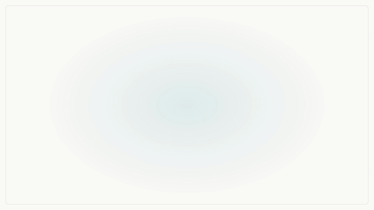
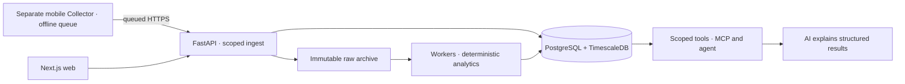

<h1 align="center">Somatriq</h1>
<p align="center"><strong>Your biometric data. Your evidence.</strong></p>
<p align="center">
  <a href="LICENSE"></a>
  
  
  
</p>
<p align="center">
  <a href="#quickstart">Quickstart</a> · <a href="#architecture">Architecture</a> · <a href="#screenshots">Screenshots</a> · <a href="docs/README.md">Documentation</a>
</p>


[](docs/brand/screenshots/brag.mp4)

A self-hosted system for preserving raw wearable measurements and turning them into explainable daily features, longitudinal analysis and personal experiments. **Python calculates the statistics; AI explains structured results.**

## Why this exists

A recovery score should come with its inputs, missingness and algorithm version. Somatriq keeps the raw evidence so a change in interpretation does not erase what the device actually measured.

| Preserve | Understand | Experiment |
| :--- | :--- | :--- |
| Immutable raw frames and canonical observations | Recovery, HRV, sleep and longitudinal context | Behavior journals and N-of-1 experiments |
| Idempotent ingestion and export | Visible coverage and versioned calculations | Deterministic statistics with uncertainty |

**Status:** active prototype. Server, analytics and web features are implemented; mobile sync lifecycle, hardware acceptance and deployment validation remain open. Dashboard screenshots use synthetic data. Somatriq is independent of WHOOP and is not a medical device.

## Quickstart

Requires Python 3.12 with `uv`, plus Node.js and npm for the web app.

```bash
git clone https://github.com/Gjusev/somatriq.git
cd somatriq
uv sync
uv run pytest -q
cd apps/web
npm ci
npm run typecheck
npm run build
```

This verifies the Python workspace and builds the web frontend. Database-dependent tests require their integration environment and otherwise skip. **It does not start a complete local stack.**

The Compose deployment expects a Traefik edge on an external `dokploy` network, configured `SOMATRIQ_HOST` routing and environment values. PostgreSQL stays on the private Docker network. [Setup and deployment boundaries →](docs/getting-started.md)

## Architecture



The mobile Collector is a separate NOOP-derived project. This repository contains the server, web application and analytical workspace. [Architecture and decisions →](docs/architecture.md)

## Screenshots

<details>
<summary><strong>Mobile-width web dashboard</strong></summary>

<p align="center">
  
</p>

</details>

<details>
<summary><strong>Collector design study — concept, not a shipped screen</strong></summary>

<p align="center">
  
</p>

This image is a design target. It is not evidence of a completed mobile implementation.

</details>

## Engineering decisions

| Decision | Why it matters |
| :--- | :--- |
| Preserve raw input | Derived values can be recalculated and compared across algorithm versions |
| Idempotent batch ingestion | Retrying after a connection failure does not create duplicate observations |
| Deterministic analytics | Scores and associations can be tested without a language model |
| Domain-scoped MCP | External clients receive defined tools rather than arbitrary SQL access |
| Local providers by default | External AI use is an explicit configuration and data-egress decision |

## What I'd do differently

- **Prove mobile reconnect behavior earlier.** Offline collection, retry and server acceptance deserve a hardware test before expanding analytical surfaces.
- **Make the laptop setup a first-class target.** The current deployment assumes an existing Dokploy edge; a dedicated local setup would shorten onboarding.
- **Ship fewer surfaces before validating the full loop.** A reliable path from sensor to explanation is more valuable than another isolated dashboard.

## Scope and lineage

The server is [MIT-licensed](LICENSE). The separate NOOP-derived Collector retains its own PolyForm Noncommercial terms; the server's MIT license does not relicense that project. Credits and boundaries are recorded in [NOTICE](NOTICE), [ATTRIBUTION.md](ATTRIBUTION.md) and [ADR 0004](docs/adr/0004-noop-fork-is-mobile-collector.md).

[Documentation index](docs/README.md) · [Specification](docs/SPEC.md) · [Domain language](CONTEXT.md) · [Decision records](docs/adr/)

---

Built by **Youssef Ouhaghi Ahmian** · [Mokka](https://mokka-agentur.de) · [GitHub](https://github.com/Gjusev)  
Released under the [MIT license](LICENSE).
