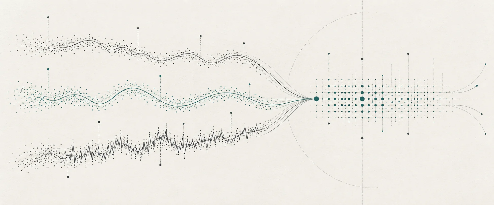
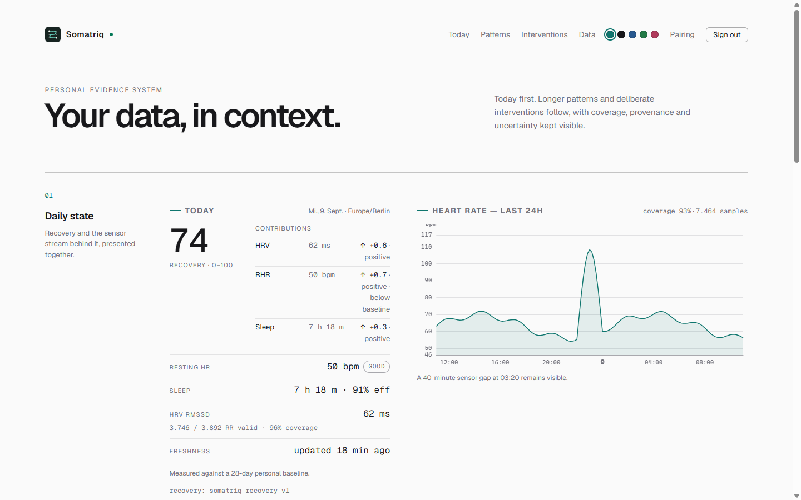
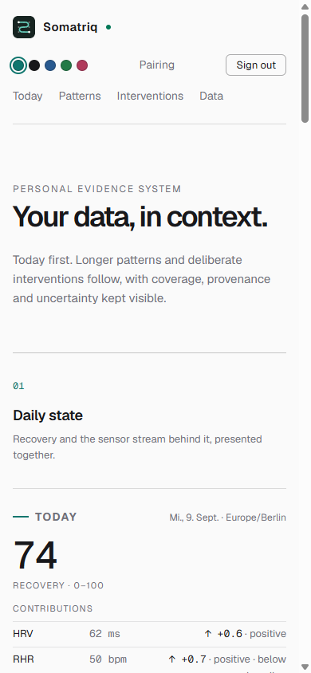
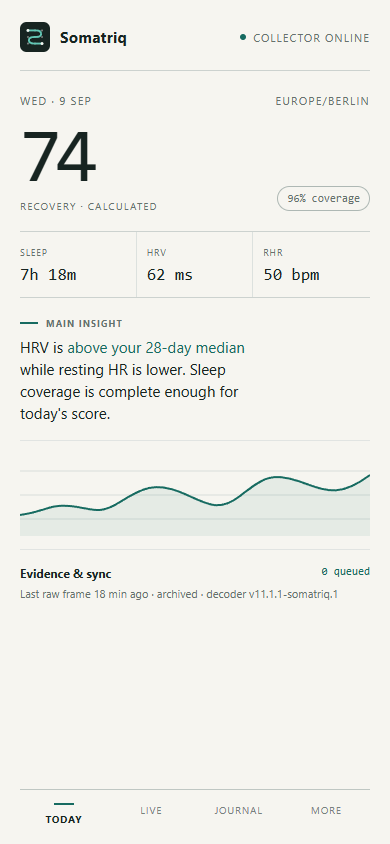

<p align="center">
  
</p>

# Somatriq

**Private biometric intelligence, from raw signal to personal evidence.**

Somatriq is a self-hosted platform for collecting, preserving and understanding longitudinal health data. Its mobile Collector is based on a maintained fork of [NOOP](https://github.com/ryanbr/noop): NOOP supplies the working WHOOP Bluetooth foundation; the Somatriq fork adds a private sync and analysis path that you control.



> Somatriq is independent, is not affiliated with WHOOP and is not a medical device. WHOOP is one supported hardware source.

## What it is now

Somatriq is an active, private prototype—not a finished consumer release. This repository contains implemented server, analytical and web slices that correspond to work planned across M0–M13; this does not mean every milestone is complete end to end:

- local account auth, phone pairing, scoped device tokens and revocation;
- idempotent batch ingest for immutable raw frames and canonical observations;
- heart-rate history, daily features, HRV and an explainable recovery score;
- data coverage, freshness, provenance and versioned algorithm semantics;
- deterministic correlations and N-of-1 experiments with explicit compliance;
- strength-session logging, load summaries and next-day recovery analysis;
- preview-first CSV import plus JSON/CSV/raw-registry export;
- domain-scoped MCP, local-first AI provider plumbing, Telegram and notifications;
- TimescaleDB/PostgreSQL storage, migration gate, backup and Dokploy-oriented operations.

The Android Collector is a separate NOOP fork by design. It already contains the Somatriq identity, local raw journal, durable queue, pairing/sync surface and server-backed science views. Lifecycle-triggered sync and end-to-end validation against real bands remain the largest mobile gaps.

## Product surfaces

| Surface | Role |
|---|---|
| **Somatriq Mobile** | NOOP-based Android Collector: BLE, local SQLite, decoding, raw capture and offline queue |
| **Web** | Today, heart-rate history, daily features, correlations, experiments, training, devices and data ownership |
| **MCP** | Scoped health and analysis tools for external AI clients; no arbitrary SQL |
| **Telegram** | Quick health questions, event logging and experiment workflows |
| **API + workers** | Validation, idempotent ingest, deterministic analytics, reprocessing and notifications |

```text
WHOOP 4.0 / 5.0 / MG
          ↓ BLE
NOOP-based Somatriq Collector
          ↓ local SQLite + queued HTTPS sync
Raw archive + PostgreSQL / TimescaleDB
          ↓
Deterministic analytics → Web · MCP · Telegram · notifications
```

## Screenshots

### Web dashboard

| Today and longitudinal analysis | Mobile-width dashboard |
|---|---|
|  |  |

### Mobile Collector direction

<p align="center">
  
</p>

The mobile image is a design target for the separate NOOP fork, not a screenshot of an already-shipped build. All screenshots use synthetic demonstration values and contain no personal health data.

## What is still missing

The next useful work is product integration rather than more isolated backend surface area:

1. Wire the Android fork's foreground/background sync lifecycle and validate offline → reconnect → exactly-once ingest on physical hardware.
2. Run end-to-end hardware acceptance on WHOOP 4.0 and track upstream parity for WHOOP 5.0/MG decoded scores.
3. Build the richer **Explore** experience: multi-year timelines, source/provenance inspection, quality overlays and instrument-boundary markers.
4. Complete PWA installability with an unauthenticated-shell-only service worker and offline-state UX.
5. Complete OAuth 2.1 authorization for MCP clients and the explicit web grant flow; scoped PATs remain the service fallback.
6. Exercise deployment, monitoring and restore drills on the target Dokploy VPS without exposing PostgreSQL.
7. Add and validate further sources through the canonical Connector boundary instead of mixing vendor logic into the health domain.

## Principles

- **Own the evidence.** Raw measurements are preserved; exports are first-class.
- **Collect locally first.** Phone and server outages must not lose data.
- **Calculate before explaining.** Python performs statistics deterministically; AI explains structured results.
- **Show uncertainty.** Missingness, quality, coverage and freshness stay visible.
- **Version meaning.** Algorithm changes never silently rewrite historical semantics.

The master specification is [`docs/SPEC.md`](docs/SPEC.md), the shared domain language is [`CONTEXT.md`](CONTEXT.md), and the recorded product decisions are in [`docs/grill/2026-09-04-spec-grill.md`](docs/grill/2026-09-04-spec-grill.md).

## Repository map

| Path | Contents |
|---|---|
| `apps/web/` | Next.js static-export web application |
| `services/` | API, worker, scheduler, agent, MCP, Telegram and notifications |
| `packages/` | Contracts, database, analytics, agent tools, connectors and observability |
| `database/` | Alembic migrations and TimescaleDB structures |
| `infra/` | PostgreSQL, backup and monitoring assets |
| `docs/adr/` | Architecture Decision Records |
| `docs/brand/` | Brand mark, editorial image, usage notes and screenshots |
| `docs/design/` | Versioned visual tokens and accessibility rules |
| `docs/research/` | Durable protocol, platform and fork findings |

## Development

```bash
# Python workspace
uv sync
uv run pytest

# Web
cd apps/web
npm install
npm run typecheck
npm run build

# Full stack; includes the one-shot migration gate
docker compose up --build
```

Local behavior mirrors the intended Dokploy Compose deployment. PostgreSQL remains on the private Docker network and production operations use the official Dokploy MCP.

## License and lineage

This repository is private while licensing is finalized. `LICENSE`, `NOTICE` and `ATTRIBUTION.md` document the current position. The mobile fork inherits NOOP's PolyForm Noncommercial terms for NOOP-derived code; the server reuses documented protocol facts, never NOOP implementation code. See [ADR 0004](docs/adr/0004-noop-fork-is-mobile-collector.md) and the [fork research](docs/research/noop-fork-research.md).
