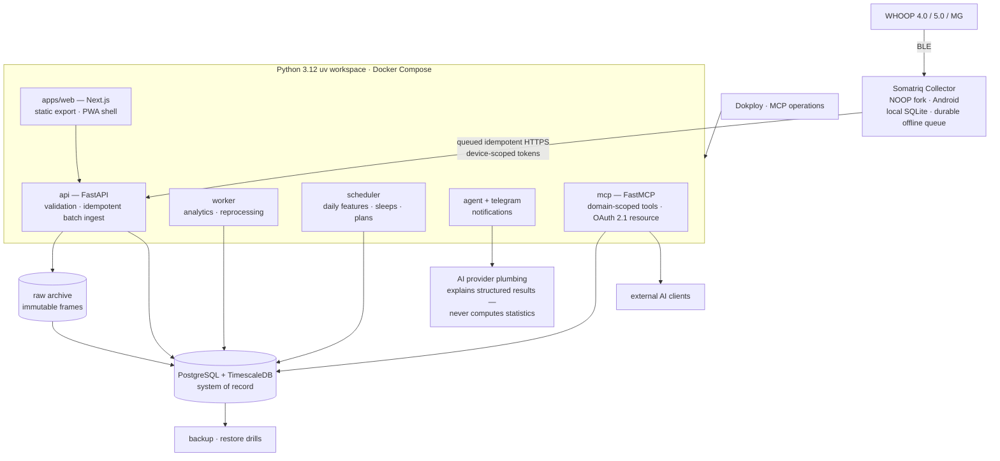

# Somatriq Architecture

Somatriq is a self-hosted biometric platform: a NOOP-forked Android collector
speaks BLE to WHOOP bands, buffers raw frames locally, and syncs them over
HTTPS into a Python service workspace where every derived number is computed
deterministically and versioned. Nothing leaves the server you own.

## System shape

## Decisions (ADRs)

The recorded decisions live in [`docs/adr/`](adr/); the load-bearing ones:

| Decision | Why |
|---|---|
| **PostgreSQL is the system of record** ([0001](adr/0001-postgresql-is-system-of-record.md)) | One database to back up, restore and trust. Everything else is reproducible from raw. |
| **TimescaleDB for high-frequency series** ([0002](adr/0002-timescaledb-for-high-frequency-series.md)) | Heart-rate frames arrive at high rates; hypertables keep queries and retention sane without a second datastore. |
| **Preserve raw sensor input** ([0003](adr/0003-preserve-raw-sensor-input.md)) | Derived values are opinions; raw frames are evidence. Reprocessing must always be possible. |
| **NOOP fork is the mobile collector** ([0004](adr/0004-noop-fork-is-mobile-collector.md)) | A maintained upstream already solved BLE pairing/decoding; the fork adds private sync. Protocol facts are reused, never upstream code. |
| **Mobile is local-first** ([0005](adr/0005-mobile-is-local-first.md)) | Phone and server outages must not lose data; sync drains a durable queue. |
| **Server sync is idempotent** ([0006](adr/0006-server-sync-is-idempotent.md)) | Offline → reconnect → retry must converge to exactly-once ingest without coordination. |
| **LLM does not calculate statistics** ([0009](adr/0009-llm-does-not-calculate-statistics.md)) | Python computes deterministically (n, p, BH-FDR q); the model only explains structured results. |
| **Health MCP is domain-scoped** ([0010](adr/0010-health-mcp-is-domain-scoped.md)) | External AI clients get scoped tools, never arbitrary SQL. |
| **PostgreSQL is not public** ([0011](adr/0011-postgresql-is-not-public.md)) | The database stays on the private Docker network; operations go through the API and Dokploy MCP. |
| **Derived values are versioned** ([0012](adr/0012-derived-values-are-versioned.md)) | Algorithm changes never silently rewrite historical semantics. |

## Service workspace

`services/` hosts one process per concern (api, worker, scheduler, agent,
mcp, telegram, notifications); `packages/` holds the shared contracts,
database layer (SQLAlchemy async + Alembic), analytics, agent tools,
connectors and observability. The web app is a static export served behind
the same deployment; a one-shot `somatriq_migrate` container gates every
stack start on migrations being current.

## Data integrity model

- **Idempotent batch ingest** — device tokens are scoped and revocable;
  batches carry client-generated identifiers; replays converge.
- **Immutable raw + canonical observations** — raw frames land in an
  append-only archive; canonical observations are derived and re-derivable.
- **Coverage, freshness, provenance** — every surface shows what it does not
  know: gaps, device boundaries, algorithm versions, timezone changes.
- **Deterministic analytics** — correlations, N-of-1 experiments and
  recovery/sleep-need scores are pure functions of stored inputs, versioned
  by algorithm.
